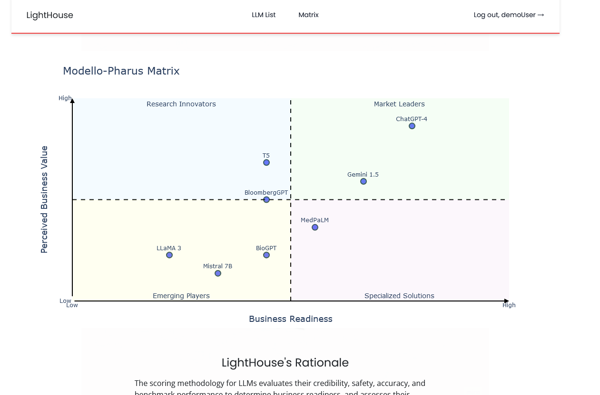
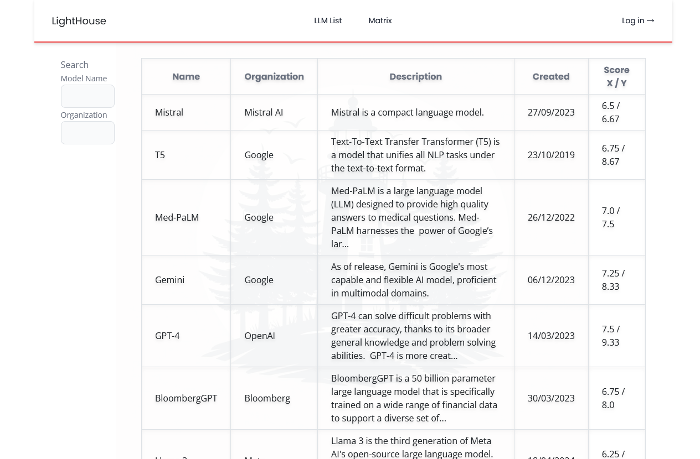
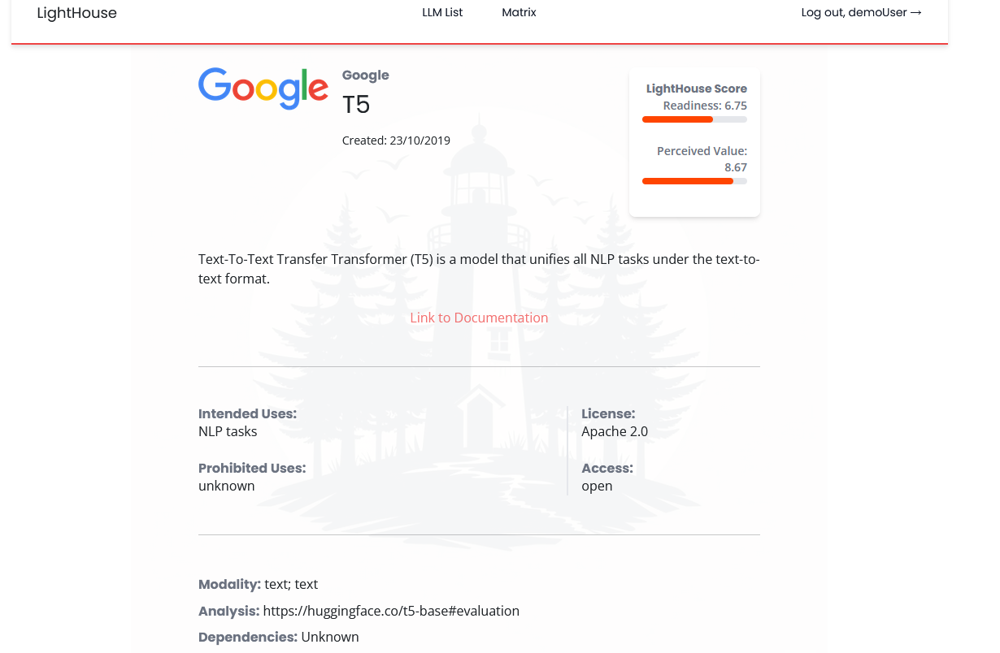
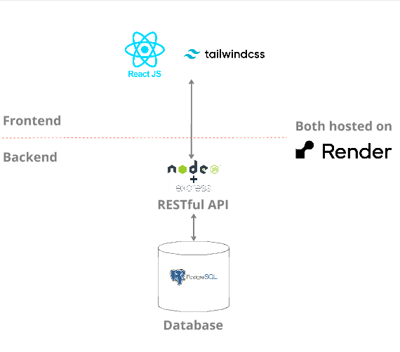
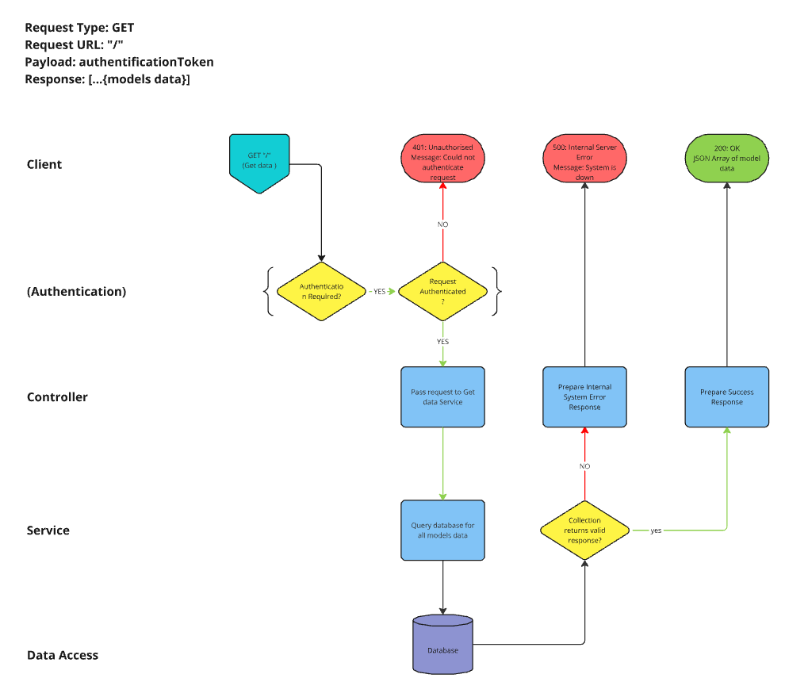
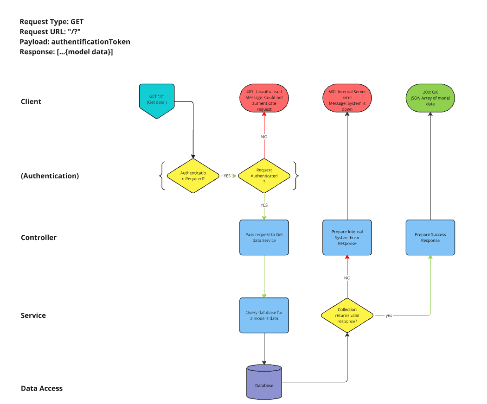
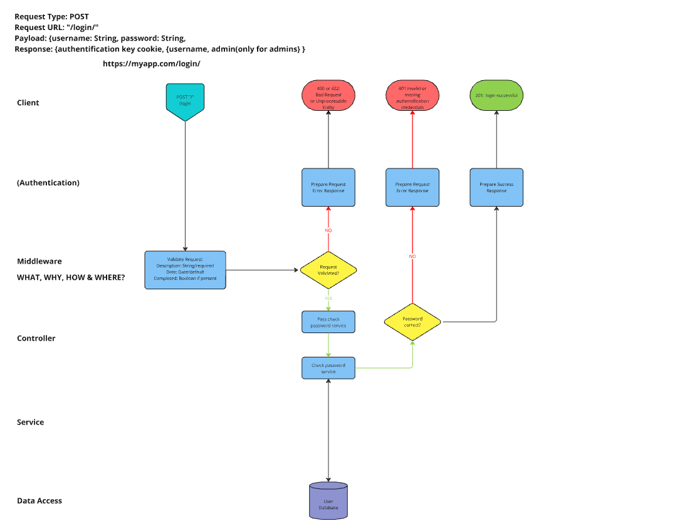
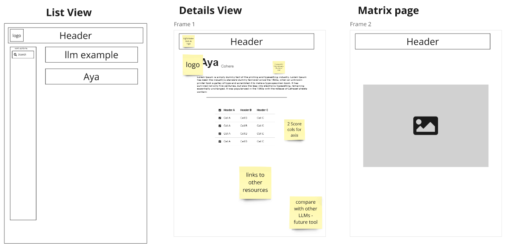

# Modello Pharus Horizon X Hackathon

## The Challenge

### The Problem

- What Large Language Models (LLMs) for regulated industries (banking, pharma, etc) are out there?
- which ones should be looked into? which ones should be avoided?

for the people who encounter these problems, what resources are there to help them over come them?

### The Deliverables

#### 1. Matrix

- Gartner-like matrix
- Containing 6-8 LLMs representing different LLMs
- Determine the names of each quadrant, weigh important factors
- Create a system of analysis for qualitatively analysing the LLMS

#### 2. LLM Catalog

- A website displaying a list of the different LLMs
- Individual pages going into a dedicated more detailed page
- Clean and professional layout, minimalist design, consistent look
- Ample white space
- Easy navigation

## The Team

### Data Analyst

- Alex Martin - LLM research, Scoring Analysis

### Data Engineers

- Vianka Govender - producing queries, adding data into database
- Nick Armstrong - creating and managing the database, producing queries

### Software Engineers

- Nick Ko - TailwindCSS, Components
- Ian Garraway - Utility algorithms, Auth, Servers

### Project Management Methodology

The project was approached with an Agile based methodology. At the start of the project a Miro board was created for collaborative sharing of ideas, designing the interface and agreeing upon a data structure. A Kanban board was created with the stories for the sprint. The team then agreed upon the split of responsibilities based on our skill sets. Each morning we met for a short meeting to discuss the previous day's progress and any blockers which might have arisen.

## The solutions

In this repo you will find the solutions for the two deliverables.
In visualisation is the final product for the first deliverable, the matrix.
In website you will find three folders, one for the front end, and two for the different microservices of the back end.

### The Data

### The Matrix

### The Website

From the brief, we knew the site needed to be a clean simple professional design. No garish colour schemes or excessive amounts of detailed crammed into the space and a consistent theme across the site. To link in with the competition giver's colours, a red line was used as an accent colour as part of the header, and a more muted red was used to highlight a model if the user puts their cursor over it.

To break up the background a image of a lighthouse amongst some trees was generated using AI and combined with transparency turned into a background watermark.

The site is largely responsive to device, however works best landscape on mobile devices.

#### Final Product

#### Tech Stack

- Frontend: React.js, TailwindCSS
- Backend: Node.js, Express.js, PostgreSQL (Database)
- API Layer: RESTful APIs with Express.js

- authentication using jwtoken in a http only cookie
  
a demonstration version was deployed on the Render webservice. (https://modellopharus.onrender.com/)

#### Distribution of work

Although at times we split to work on separate functions, it was mostly a paired programming approach used to produce the website. With prior experience with Tailwind, Nick took the lead on the websites appearance.  Ian took the lead on the backend services, the front end utilities, and ensuring the APIs connection to the database was functioning.

#### Routes

Get all models

Get one model

Login

#### WireFrames

#### Testing

Where possible, a test driven development approach was taken, however the majority of the testing was done through manual testing of the website as the majority of the code is largely static. Vitest was used to ensure the utility algorithms worked as intended.

## Where next

### Website

a few of the features we discussed, but were unable to implement:

- Additional filter options
- Allow the user to choose what information is displayed on the catalog.
- Model Comparison screen
- User saved model list
- User added models
- User discussion (social interaction)
- User reviews
- User profiles
