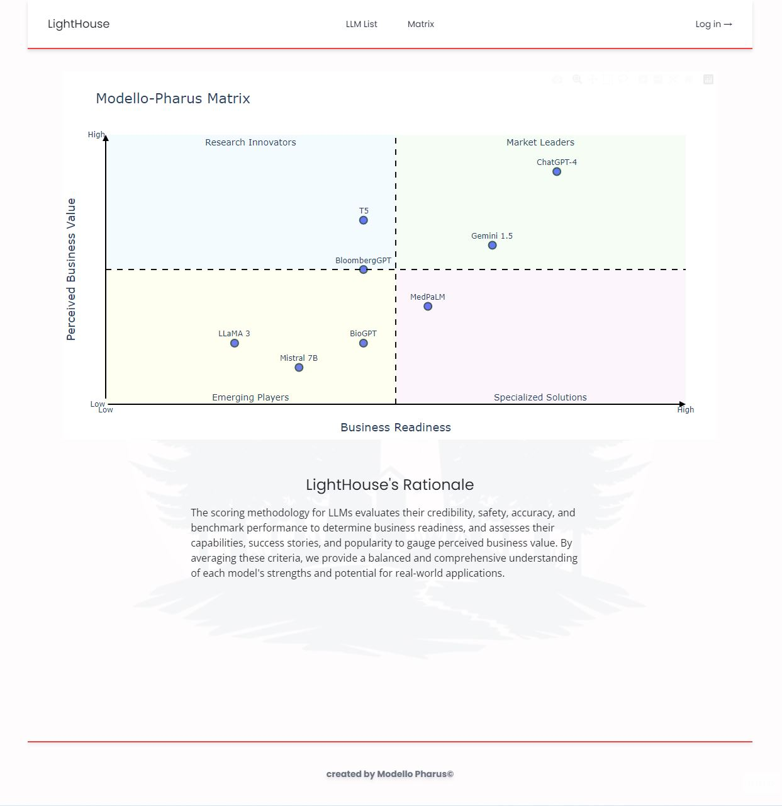

# Modello Pharus Horizon X Hackathon

## The Challenge

### The Problem

- What Large Language Models (LLMs) for regulated industries (banking, pharma, etc) are out there?
- which ones should be looked into? which ones should be avoided?

for the people who encounter these problems, what resources are there to help them over come them?

### The Deliverables

#### 1. Matrix

- Gartner-like matrix
- Containing 6-8 LLMs representing different LLMs
- Determine the names of each quadrant, weigh important factors
- Create a system of analysis for qualitatively analysing the LLMS

#### 2. LLM Catalog

- A website displaying a list of the different LLMs
- Individual pages going into a dedicated more detailed page
- Clean and professional layout, minimalist design, consistent look
- Ample white space
- Easy navigation

## The Team

### Data Analyst

- Alex Martin - LLM research, Scoring Analysis

### Data Engineers

- Vianka Govender - producing queries, adding data into database
- Nick Armstrong - creating and managing the database, producing queries

### Software Engineers

- Nick Ko - TailwindCSS, Components
- Ian Garraway - Utility algorithms, Auth, Servers

### Project Management Methodology

The project was approached with an Agile based methodology. At the start of the project a Miro board was created for collaborative sharing of ideas, designing the interface and agreeing upon a data structure. A Kanban board was created with the stories for the sprint. The team then agreed upon the split of responsibilities based on our skill sets. Each morning we met for a short meeting to discuss the previous day's progress and any blockers which might have arisen.

## The solutions

In this repo you will find the solutions for the two deliverables.
In visualisation is the final product for the first deliverable, the matrix.
In website you will find three folders, one for the front end, and two for the different microservices of the back end.

### The Data

### The Matrix

### The Website

To align with the design brief, we aimed for a minimalistic yet professional look that made use of lots of whitespace. We adopted a shade of red into the simple colour palette inspired from HorizonX to accent certain elements. A muted version of the red was used as a hover effect when the cursor is over the LLM table row. The fonts Poppins and Open-sans were chosen for the headings and body text, respectively. They're popular across the technology industry and provide a clean and modern feel to the website.

We chose a simple text logo to display in the left of the header, but also made use of generative AI to produce a lighthouse watermark image to use as a subtle background that is intended to add an extra dimension to the page.

The page width is set to be relatively narrow, thus creating extra white space and condensing elements into an A4 shape instead of spanning the entire width of a widescreen monitor. We felt this would limit the need for eyes to wander across screens.

The site is largely responsive to device, however works best landscape on mobile devices.

### Final Product

#### Catalog Page

We limited the table view to the minimal number of columns we thought relevant for a first glance to maintain a tidy page. The description column is set to limit the number of characters to display, so as to not bloat rows.

The background is set to be transparent to allow the subtle watermark to show and add that desired extra dimension. Table headers are styled to be bold to differentiate from the body text, but coloured a muted grey so as to not be too dominating. They are highlighted with a subtle drop shadow.

#### Details page

##### Structure
The details layout is structured in a way that aims to display a high-level summary at first glance. This is achieved by grouping the LLM name, organisation, created date, documentation and description together. Added to this is a score card displaying our custom metrics for the particular LLM as a result of the matrix analysis supported with a progress bar style element to help visualise the metric. We also added logo's based on the organisation to further add some visuals.

As we move down the page, the details provided become more technical and of more interest to those that are looking for specific information.

Sections are clearly grouped and easily readable by making use of whitespace and horizontal rules to break up the content.

#### Matrix Page

##### Structure
The matrix page is dedicated to displaying the scoring matrix. It holds the top-most section of the page due to its importance. Below is a supporting paragraph that aims to provide a brief summary of the method behind the scoring of each LLM to provide some context.

A minimal footer is displayed on every page but is easily visible with the Matrix screenshot. The footer is pushed to the bottom of the screen when the page is shorter than the browser window to make use of all the available whitespace.

---

#### Tech Stack

- Frontend: React.js, TailwindCSS
- Backend: Node.js, Express.js, PostgreSQL (Database)
- API Layer: RESTful APIs with Express.js

- authentication using jwtoken in a http only cookie
  
a demonstration version was deployed on the Render webservice. (https://modellopharus.onrender.com/)

#### Distribution of work

Although at times we split to work on separate functions, it was mostly a paired programming approach used to produce the website. With prior experience with Tailwind, Nick took the lead on the websites appearance.  Ian took the lead on the backend services, the front end utilities, and ensuring the APIs connection to the database was functioning.

#### Routes

Get all models

Get one model

Login

#### WireFrames

#### Testing

Where possible, a test driven development approach was taken, however the majority of the testing was done through manual testing of the website as the majority of the code is largely static. Vitest was used to ensure the utility algorithms worked as intended.

## Where next

### Website

a few of the features we discussed, but were unable to implement:

- Additional filter options
- Allow the user to choose what information is displayed on the catalog.
- Model Comparison screen
- User saved model list
- User added models
- User discussion (social interaction)
- User reviews
- User profiles
